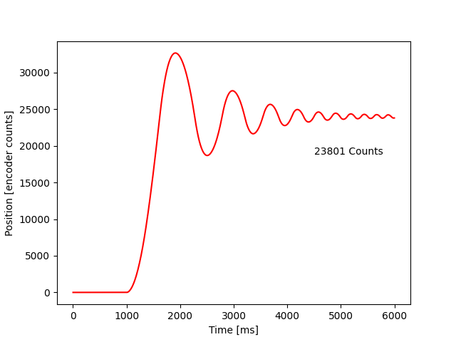
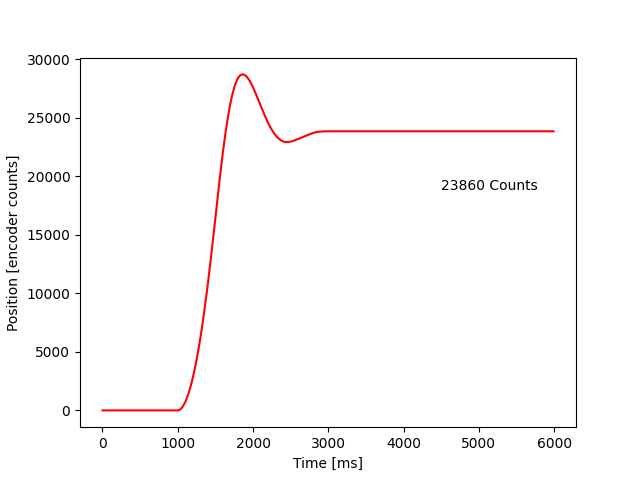

# Lab 2: Developing A Motor Controller

In this lab, we develop a motor controller which can interface
with an optical encoder and a permanent magnet direct current (PMDC or DC)
motor.

Within the main file, when doing a step response analysis of the motor
which we will see below, an input Kp is prompted. Then cycles of the motor
controller update itself with data from the encoder, and passing the 
desired duty cycle into the motor periodically, about 100 times a second (100Hz).
This is 10ms between each cycle.

First, in a cycle of updating the motor within the main.py file, the
encoder is first read to determine the position of the system. The position
for this assignment is in a unit of Counts because of the two different
motors we were using. The encoder has 1000 counts per revolution. So with
the 16:1 gearbox, there will be 16000 counts for 1 revolution. The
motor with a plastic flywheel has no gearbox so it has 1000 Counts per 
Revolution.

Then, this position information is passed into the motor controller. This
motor controller created a value of desired duty cycle, which contains a
0-100 value to tell the motor what power it should run at, as well as a
sign for direction. It does this by subtracting the input desired position
from the current position, and then multiplying that difference by a
proportional gain Kp. Note: this desired duty cycle can produce an
oversaturated value, meaning a motor cannot physically produce more than 
100% power even though we can tell it to.

This desired duty cycle is then passed into the motor driver, which updates
the duty cycle of the PWM signal that we are passing into the motor to 
modulate the power of the motor.

This whole cycle happens roughly 100 times per second. We can manipulate
the reaction of the system by changing the Kp value mentioned in the
paragraph explaining the controller. Below, we can see the results.

This first graph shows a step response of a Kp that is set too high. This value
being too high results in too fast of a reaction and causes excessive oscillation
of the system. Kp = 0.5

We can produce a better system reaction by lowering the Kp from this point. Below 
we can see that now, the system settles, though there is still some overshoot 
present. Kp = 0.01

Lowering it further, we produce the best response. There is a little overshoot, but
the system eventually settles to a desired value. There is some steady state error.
Kp = 0.005

Lowering it further, we produce a system that is too slow, as seen below. We have left ideal behavior 
and are back to non-ideal behavior. To fix this, we need to raise the Kp. Kp = 0.001
